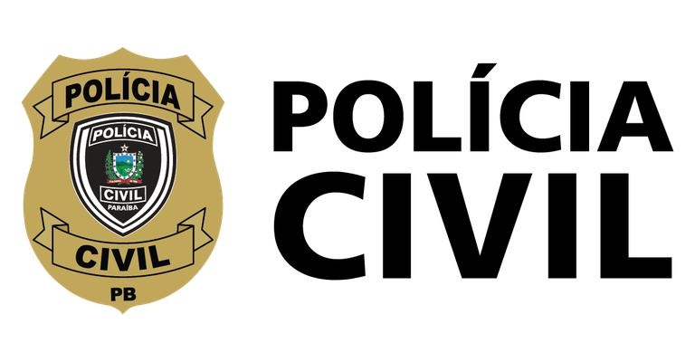

<p align="center"><a href="https://laravel.com" target="_blank"></a></p>


## Sobre o Boilerplate

Este boilerplate foi construido utilizando a versão 8 do Framework Laravel e utiliza como pacote de CSS/Frontend o [AdminLTE](https://adminlte.io/) 3.2 que é baseado em Bootstrap 4. As principais funcionalidades deste projeto incluem a integração com a API do Sistema de Recursos Humanos da PCPB, pacote de auditoria [Laravel Auditing](https://laravel-auditing.com/), sistema de ACL com Perfis e Permissões, entre outros.
Laravel is accessible, powerful, and provides tools required for large, robust applications.

## Aprendendo Laravel

O Laravel tem a mais extensa e completa [documentação](https://laravel.com/docs) e uma biblioteca de tutoriais em vídeo de todos os frameworks modernos de aplicações web, tornando fácil começar a usar o framework.

Se você não quiser ler, [Laracasts](https://laracasts.com) pode ajudar. Laracasts contém mais de 1500 tutoriais em vídeo sobre uma variedade de tópicos, incluindo Laravel, PHP moderno, teste de unidade e JavaScript. Aumente suas habilidades explorando nossa abrangente biblioteca de vídeos.


## Iniciando o projeto

Clonando o repositório:
````
https://git.sesds.pb.gov.br/jeorgy/boilerplate-l8.git
````

Instalando as dependências:
````
composer install
````

Copiar arquivo de variáveis de ambiente:
````
cp .env.example .env
````

Gerando a Key do projeto:
````
php artisan key:generate
````

Rodando as migrations e populando o banco de dados:
````
php artisan migrate:fresh --seed
````


Iniciando o servidor de desenvolvimento:
````
php artisan serve
````

Faça login usando os dados:

Matrícula: 000000

Senha: password

## License

O framework Laravel é um software de código aberto licenciado sob a [licença MIT](https://opensource.org/licenses/MIT).
